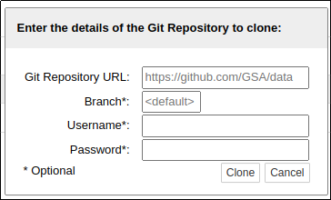

# plusGitRepo

This extensions adds a pop-up interface to the existing `nbgitpuller` (https://github.com/jupyterhub/nbgitpuller) extension.

`nbgitpuller` lets you distribute content in a git repository to your students by having them use a simple link. nbgitpuller's [Automatic merging](https://jupyterhub.github.io/nbgitpuller/topic/automatic-merging.html) ensures that your students are never exposed to git directly.
## Installing

You need to _install_ this package, and it will install `nbgitpuller` as a dependency

You need to _enable_ both `nbgitpuller` **and** this package:


```
git clone --single-branch --depth 1 https://github.edina.ac.uk/edina/repoGitPlus
pip install -q ./repoGitPlus
jupyter serverextension enable --py nbgitpuller --sys-prefix
jupyter nbextension enable --py plusGitRepo
```

## Using

The extension adds a button to the Notebook Toolbar:


Clicking on the `+GitRepo` button opens a popup to enter the git URL (and branch) to pull down:



Note that the URL is the web address of the repository, the one you would use to look at the data online, not the git address: `https://github.com/GSA/data` not `https://github.com/GSA/data.git`

`+GitRepo` will clone the default branch.

Clicking `Clone` will download the reposiory, and change you into that directory.

### Optional parameters

 From mid-2020, GitHub switched from `master` to using `main` as the default name for the central branch in repositories. If you need a specific branch, you can specify it.

If you need to access an _authentincated_ repository, then you can supply an appropriate username & password.


### Notes

* `+GitRepo` will _always_ clone a repo into a folder off the users _home_ directory - so even if you are in the folder of one repo, and use the interface to call another one, `+GitRepo` will clone that repo into it's own folder, and change you into that folder.

* See the link at the top of the page for details on `nbgitpuller`'s automatic merging rules.

* We have included a Dockerfile for you to try the extension:

```
docker build -t test .
docker run -it --rm -p 8888:8888 test
```